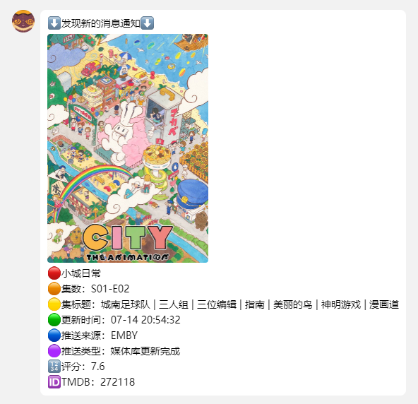
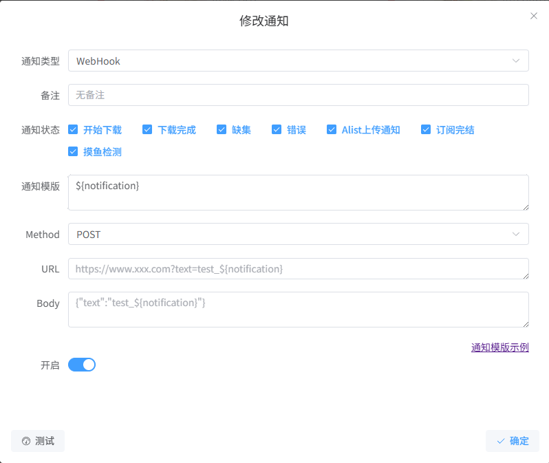
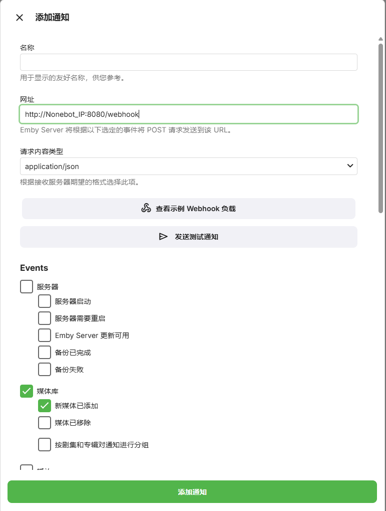

<div align="center">
  <a href="https://v2.nonebot.dev/store"></a>
  <br>
</div>

<div align="center">

# nonebot-plugin-AniPusher

_✨ NoneBot AniPusher插件 ✨_<br>
NoneBot AniPusher插件 是将特定Webhooks消息推送至QQ的插件<br>
目前支持配置来自ani-rss和emby的webhooks消息


[](./LICENSE)
[](https://pypi.python.org/pypi/nonebot-plugin-AniPusher)
[](https://www.python.org/downloads/)
</div>


## 📖 介绍

AniPusher插件 是将特定Webhook消息推送至QQ的插件<br>

目前支持AniRSS和Emby推送<br>



## 💿 安装

<details open>
<summary>使用 nb-cli 安装</summary>
在 nonebot2 项目的根目录下打开命令行, 输入以下指令即可安装

    nb plugin install nonebot-plugin-AniPusher

</details>

<details>
<summary>使用包管理器安装</summary>
在 nonebot2 项目的插件目录下, 打开命令行, 根据你使用的包管理器, 输入相应的安装命令

<details>
<summary>pip</summary>

    pip install nonebot-plugin-AniPusher
</details>
<details>
<summary>pdm</summary>

    pdm add nonebot-plugin-AniPusher
</details>
<details>
<summary>poetry</summary>

    poetry add nonebot-plugin-AniPusher
</details>
<details>
<summary>conda</summary>

    conda install nonebot-plugin-AniPusher
</details>

打开 nonebot2 项目根目录下的 `pyproject.toml` 文件, 在 `[tool.nonebot]` 部分追加写入

    plugins = ["nonebot_plugin_AniPusher"]

</details>

## ⚙️ ani-rss配置[[ani-rss项目地址](https://github.com/wushuo894/ani-rss)]
该配置方法基于ani-rss `v2.0.13` 更新后新的通知配置功能<br>

`ani-rss → 设置 → 通知 → 添加通知`<br>
↓按如下配置↓<br>


通知类型为`Webhook`<br>
Method为`POST`<br>
URL为Nonebot2的IP地址和端口下的路径`/webhook`<br>
例如`http://Nonebot_IP:8080/webhook`<br>

↓Body请复制下方Json填入↓<br>

```json
{
  "ani": "${action}",
  "action": "${action}",
  "title": "${title}",
  "jpTitle": "${jpTitle}",
  "score": "${score}",
  "themoviedbName": "${themoviedbName}",
  "tmdbid": "${tmdbid}",
  "tmdbUrl": "${tmdburl}",
  "bgmUrl": "${bgmUrl}",
  "season": "${season}",
  "episode": "${episode}",
  "subgroup": "${subgroup}",
  "progress": "${currentEpisodeNumber}/${totalEpisodeNumber}",
  "premiere": "${year}-${month}-${date}",
  "text": "${text}",
  "downloadPath": "${downloadPath}",
  "episodeTitle": "${episodeTitle}",
  "bgmEpisodeTitle": "${bgmEpisodeTitle}",
  "bgmJpEpisodeTitle": "${bgmJpEpisodeTitle}",
  "image": "${image}"
}
```
> [!TIP]
> 如果未来AniRSS更新通知配置发生变化，需更改Body结构时，请保留键```"ani": "${action}"```，程序判断数据来源依赖此键！<br>
> 其余键值对可根据ani-rss的使用文档中通知下的通知模板对应的键结构进行更改<br>

## ⚙️ Emby配置
首先请确保你已在Emby服务器上安装了Webhooks插件（该插件目前已自动集成，应该不用再手动装了）<br>

`Emby → 设置 → 通知 → 添加通知 -> Webhooks`<br>
↓按如下配置↓<br>


网址为Nonebot2的IP地址和端口下的路径`/webhook`<br>
例如`http://Nonebot_IP:8080/webhook`<br>
请求内容类型为`application/json`<br>
Event目前只支持`媒体库-新媒体已添加`<br>
其他选项根据自身需求更改<br>


## ⚙️ 插件配置

配置项位于 nonebot2 项目根目录下的 `.env` 文件内<br>
运行时如果没有检查到配置项，插件将自动在`.env` 文件内创建配置项，前往按照说明填入即可。<br>
所有配置项均为非必选项，但建议填写。配置项缺失会导致对应功能被关闭。<br>

> [!IMPORTANT]
> 缺少Emby_Host或Emby_ApiKey时，插件将无法验证视觉图有效性，不会下载或更新封面图片。<br>
> 缺少Tmdb_ApiKey时，插件将无法验证TMDB ID,导致数据无法存入数据库，无法订阅对应内容。<br>
> 缺少Tmdb_Proxy时，插件将仅尝试直连TMDB API,如失败则无法验证TMDB ID,导致数据无法存入数据库，无法订阅对应内容。<br>

| 配置项 | 必填 | 默认值 | 说明 |
|:----|:----:|:----:|:----:|
| anipush__emby_host | 否 | 无 | Emby的服务器地址（请勿填写中转地址）|
| anipush__emby_apikey | 否 | 无 | Emby服务器-高级-API密钥中生成的密钥 |
| anipush__tmdb_apikey | 否 | 无 | TMDB用户的ApiKey|
| anipush__tmdb_proxy | 否 | 无 | TMDB代理，如不填写则不使用代理 |

## 🎉 使用
### 指令表
| 指令 | 权限 | 需要@ | 范围 | 说明 |
|:-----|:----:|:----:|:----:|:----|
| 注册Emby推送 | ALL | 否 | 私聊/群聊 | 群聊：发送指令后即将群组添加到Emby更新消息推送列表中，有新消息时将消息推送到群内<br>私聊：发送指令后即将用户添加到Emby更新消息推送列表中 |
| 注册AniRSS推送 | ALL | 否 | 私聊/群聊 | 群聊：发送指令后即将群组添加到AniRSS更新消息推送列表中，有新消息时将消息推送到群内<br>私聊：发送指令后即将用户添加到AniRSS更新消息推送列表中 |
| 取消Emby推送 | ALL | 否 | 私聊/群聊 | 群聊：发送指令后关闭群组更新消息推送，不再接收推送<br>私聊：发送指令后关闭用户更新消息推送，不再接收推送 |
| 取消AniRSS推送 | ALL | 否 | 私聊/群聊 | 群聊：发送指令后关闭群组更新消息推送，不再接收推送<br>私聊：发送指令后关闭用户更新消息推送，不再接收推送 |
